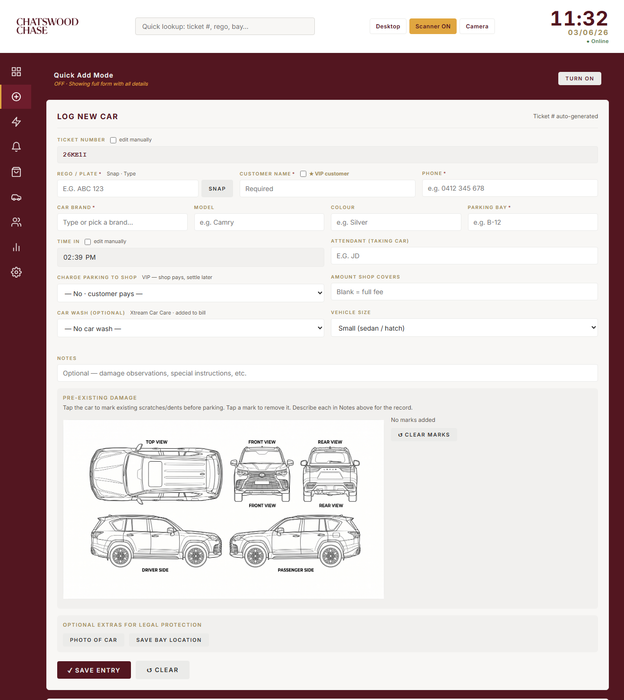
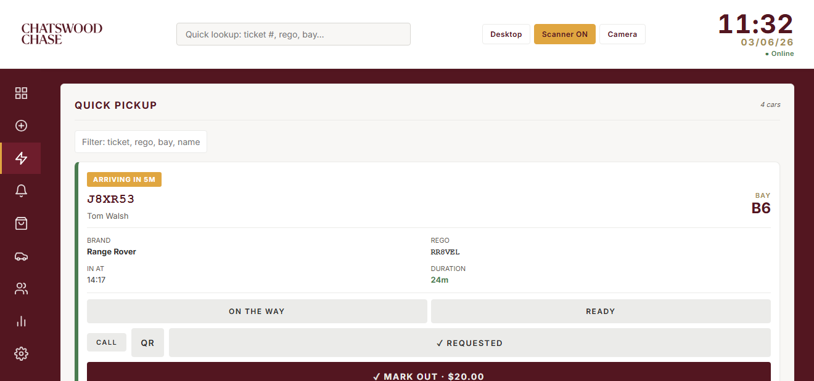
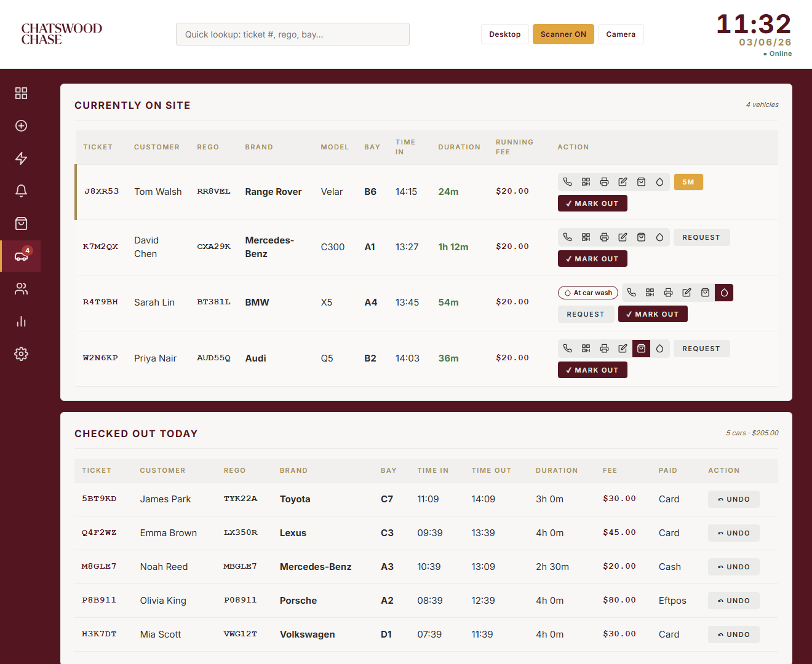
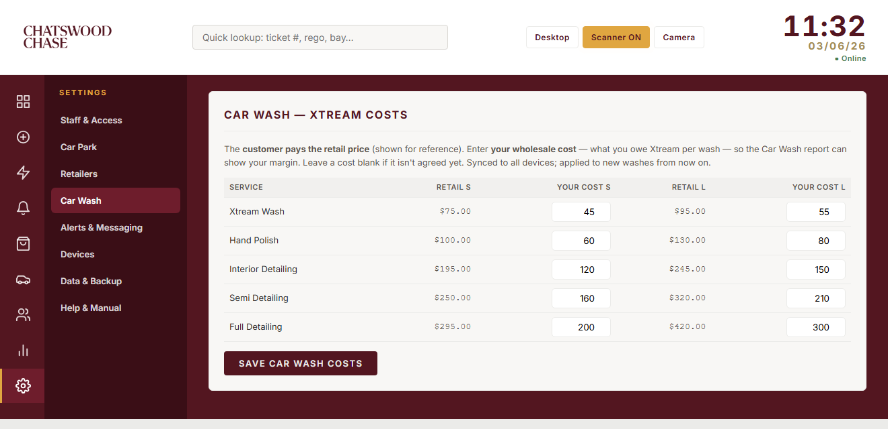
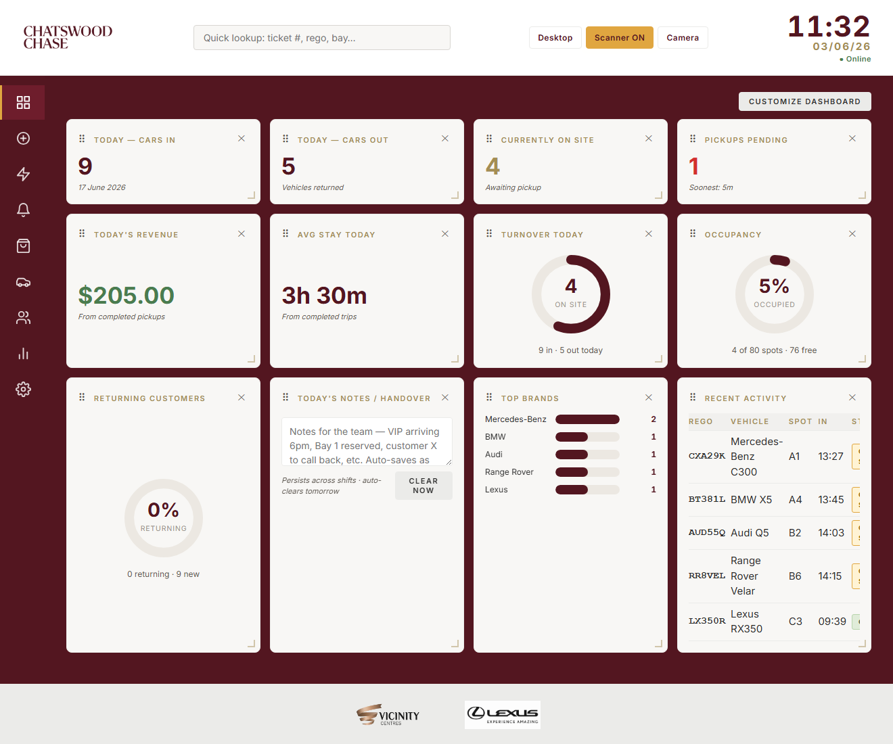
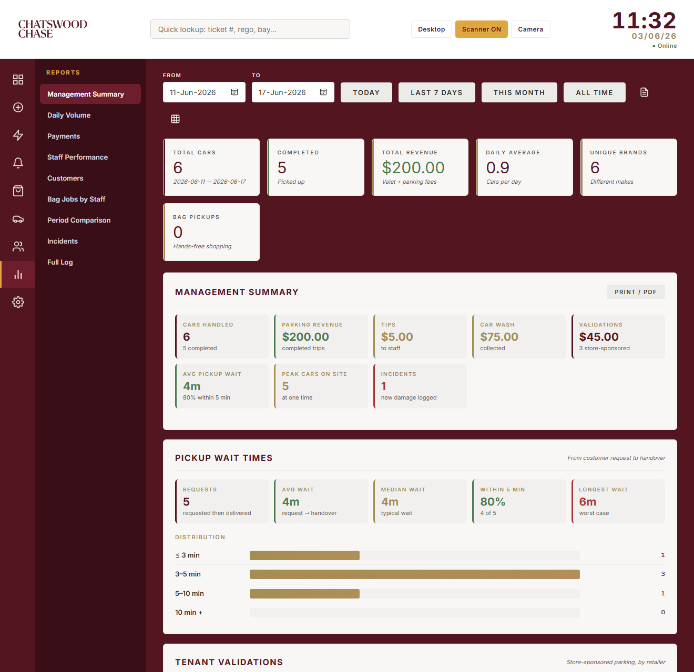
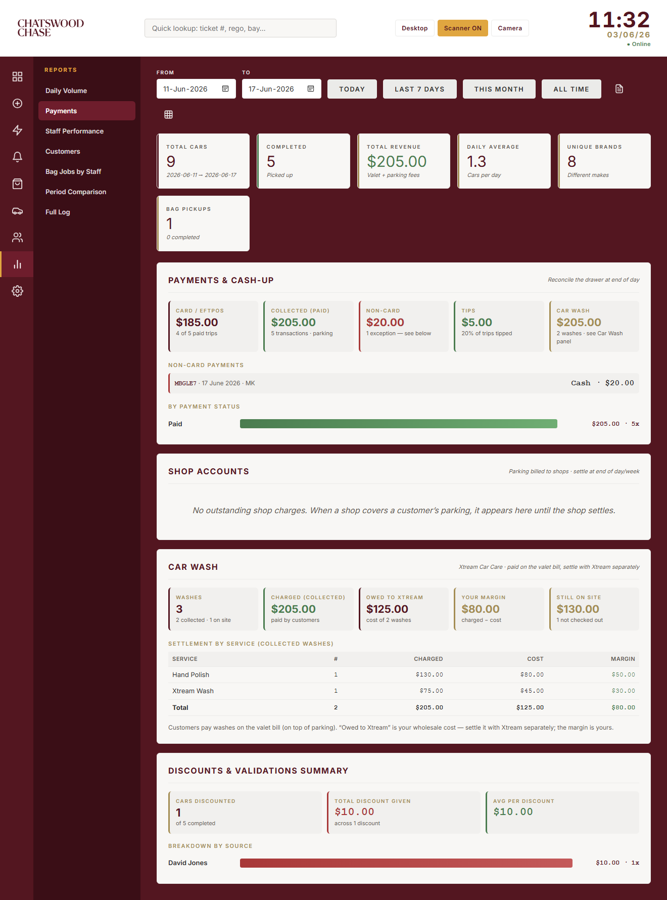

# Chatswood Chase Valet App — Staff & Manager Manual

How to run the day-to-day valet operation and manage the system.

> A styled, printable version of this manual is at **`manual.html`** (open it and use **Print → Save as PDF**). In the app, open it any time from **Settings → Help & Manual**.

## Contents
**Getting started:** [1. What this app is](#1-what-this-app-is) · [2. Logging in & screen modes](#2-logging-in--screen-modes) · [3. The tabs at a glance](#3-the-tabs-at-a-glance)
**Daily operations:** [4. Checking a car IN](#4-checking-a-car-in) · [5. Returning a car](#5-returning-a-car-quick-pickup) · [6. Pickup Queue](#6-the-pickup-queue) · [7. Active Cars](#7-active-cars) · [8. Checking out & payment](#8-checking-a-car-out--payment) · [9. Bags](#9-bags-hands-free-shopping) · [10. Car wash](#10-car-wash-service)
**Insight & admin:** [11. Dashboard](#11-the-dashboard) · [12. Customers](#12-customers) · [13. Reports](#13-reports) · [14. Settings](#14-settings-manager) · [15. Hardware](#15-hardware--integrations)
**Reference:** [16. Pricing](#16-pricing-reference) · [17. Troubleshooting](#17-troubleshooting) · [18. Glossary](#18-glossary)

---

## 1. What this app is
The Chatswood Chase valet dashboard — a single web app that runs in the browser on every device at the stand (counter PC, tablets, staff phones). It tracks every car from drop-off to pick-up, takes payment, prints key tags, texts customers their ticket, and gives the manager live reports.

- **Cloud-synced:** all devices share the same live data. A car logged on the tablet appears on the counter PC within a couple of seconds.
- **Works offline:** if the internet drops, the app keeps working and syncs everything once it reconnects.
- **Installable:** can be added to a tablet's home screen like an app (full-screen).

> **Golden rule:** log the car the moment you take the keys, and mark it out the moment the customer drives away. Reports, revenue and "cars on site" are only as accurate as the timing of your taps.

## 2. Logging in & screen modes
**Logging in** — sign in with your staff name and password. Each staff member has their own login so the app can credit who parked and who returned each car (Staff Performance report). Logins are managed under *Settings → Staff & Access*.

**Mobile vs Desktop mode** — a toggle in the top bar (remembered per device):
- **Mobile** — fewer tabs (New Entry, Quick Pickup, Queue, Bags, Active Cars). Best on a phone at the kerb.
- **Desktop** — every tab including Dashboard, Customers, Reports, Settings. Best on the counter PC.

Turn on **keep-screen-awake** (Settings → Devices) on the counter tablet so it doesn't sleep mid-shift.

## 3. The tabs at a glance
| Tab | What it's for |
|---|---|
| **Dashboard** | Live snapshot of the day — cars in/out, on site, revenue, handover notes, top brands, recent activity. |
| **New Entry** | Check a car in (the drop-off form). |
| **Quick Pickup** | Find a car fast to return it — scan the key tag or search. |
| **Queue** | Cars customers have requested, with a countdown. |
| **Bags** | Hands-free shopping — bags collected from stores and put in the car. |
| **Active Cars** | Every car on site, with duration, running fee and all actions. |
| **Customers** | Searchable database of everyone who's used the valet. |
| **Reports** | Manager analytics. |
| **Settings** | Manager setup. |

Queue, Bags and Active Cars show a number badge when something's waiting.

## 4. Checking a car IN
Go to **New Entry**. Ticket number and time-in fill automatically. Required fields are marked.

| Field | Notes |
|---|---|
| **Customer Name** *(required)* | Who the car belongs to. |
| **Phone** *(required)* | Australian mobile (`0412 345 678`). Used to text the ticket and pickup updates. |
| **Car Brand** *(required)* | Make; Model and Colour optional but helpful. |
| **Parking Bay** *(required)* | Where you parked it (e.g. `A1`). Critical for finding it. |
| **Number plate (Rego)** *(required)* | Type it, or use the camera to read it (Plate scan). |
| **Attendant** | Your initials — credits you as the parker. |
| **Charge parking to shop** | VIP / store-validated — shop pays, settle later. Optionally set the amount covered. |
| **Car wash** | Optional — add a wash now (section 10). |
| **Notes** | Damage, special instructions, etc. |
| **VIP** | Tick to flag a VIP. |

- **Pre-existing damage:** tap the car diagram to mark scratches/dents *before* parking. Shown again at checkout to verify condition — your protection against false claims.
- **Photo & location:** optionally attach a car photo and capture GPS at drop-off.

**Save** triggers automatically: key tag prints (if a printer is set up), the customer is texted their QR ticket (if a mobile was entered), and the car appears on Active Cars and the Dashboard on every device.

## 5. Returning a car (Quick Pickup)
When a customer returns, use **Quick Pickup**:
- **Scan** the key tag / their QR ticket — jumps straight to the car.
- **Search** by ticket, name, plate or bay.

The card shows bay, duration and fee due; go straight to checkout. The top-bar search box works from any screen too.

> **Lost ticket?** Tap **🎫 Lost ticket** on Quick Pickup, search the on-site cars by name/plate/phone, confirm the customer's identity (two details or photo ID), then release. The release is logged against your login.

## 6. The Pickup Queue
When a customer asks for their car ahead of time, put it in the **Queue**:
- From Active Cars tap **Request** and enter the ETA (minutes until they want it).
- The Queue sorts by urgency (most overdue first). The button counts down and changes colour: bronze → amber → red (**now / overdue**).
- You can push a live status to the customer's ticket page — "on its way" or "ready at the desk".

## 7. Active Cars
The working list of every car on site: ticket, customer, plate, brand, bay, time in, duration, running fee. Duration is colour-coded: green <2h, amber 2–4h, red 4h+, flashing red 6h+.

**Row actions** — grouped icons for occasional actions; two buttons on the right for the common ones:

| Action | What it does |
|---|---|
| 📞 Call | Phones the customer (if a number is on file). |
| QR | Re-sends the QR ticket link by text. |
| Print | Re-prints the key tag. |
| Edit | Fix bay, time in or customer details. |
| Bag | Log a hands-free shopping bag pickup (section 9). |
| Droplet | Add or manage a car wash (section 10). |
| **Request** | Put the car in the pickup queue with an ETA. |
| **✓ Mark Out** | Check the car out and take payment. |

Below the list is a **Checked Out Today** section.

> **Overstay alerts:** a banner at the top of Active Cars lists any cars left **overnight** (still on site since before the last closing time) or **over a set number of hours** (default 6, adjustable in *Settings → Car Park → Overstay Alert*). Tap a car's chip to go straight to its checkout.

## 8. Checking a car OUT & payment
Tap **✓ Mark Out**. The window shows duration and the fee (parking + the $20 valet fee). Before confirming:

- **Discounts & validations** — add a store validation or a %/$ discount; each is recorded for the manager (Reports → Payments → Discounts).
- **Payment status:** **Paid** (choose method — Card is the norm here, Cash, EFTPOS or Other), **Unpaid** (shows as outstanding), **Complimentary** (free parking; a car wash is still charged), **Charged to account/shop** (settle later).
- Optionally add a **tip** or override the fee. The **Attendant (returning car)** field credits who fetched it.
- **Return condition:** every checkout has a **Return condition** step — leave it on *✓ No new damage*, or tap *⚠ New damage / incident* to describe damage found on return and tick that the customer acknowledged it. Logged incidents appear in *Reports → Incidents*.
- **Square Terminal:** tap *Charge on Square Terminal* to send the amount to the card machine; a successful charge checks the car out automatically.

> **Car still at the wash?** Checkout warns you if a car is marked "At car wash" — don't hand it back until it's returned and marked "Washed — back".

Confirm to finish — the car leaves the list, revenue is recorded, and any car wash is added on top of the parking.

## 9. Bags (hands-free shopping)
Customers leave purchases with stores; valet collects everything and loads the car. Track on the **Bags** tab:
1. Log the bag pickup (Active Cars row → Bag icon, or the Bags tab) — note store/location and number of bags.
2. The job moves through **requested → collecting → in car → done**.
   - **Several shops at once:** a car can have more than one round running at the same time. Tap the Bag icon again (or the customer taps "another shop" on their ticket) to add a new round — each gets its own photos and timing, and earlier rounds are kept. Rounds for the same car show as separate cards labelled **#1 of 2**, **#2 of 2**, etc.
3. **Claim or assign it.** Anyone can tap **I'll get it** to take a job themselves. On **desktop**, the person at the counter can instead use the **Assign to…** dropdown to hand the job to a specific bag-enabled staff member — it then **rings on that person's phone** (sound + vibration + an "Assigned to you" popup) and shows as **YOUR JOB** (highlighted) in their Bags queue. If that staff member has turned on **alerts** for their phone (Settings → Car-Request Alerts) and is logged in as themselves, they also get an **OS notification even when the app is closed**. Picked the wrong person? Open the job and use the **Reassign…** dropdown to switch them, or choose **↺ Unassign** to put it back in the open queue.
4. **One proof photo** is taken **in the car** when you load the bags (required; sent to the customer as confirmation). *(An in-shop photo step exists in the app but is currently turned off until we have each shop's permission.)*
5. Both the collector and the loader are credited (Reports → Bag Jobs by Staff).

The Bags badge shows open jobs.

## 10. Car wash service
Valet customers can add a car wash from **Xtream Car Care** in the centre. Valet handles it end-to-end and the customer pays on the same valet bill.

1. **Add the wash** — at check-in (the "Car wash" picker) or anytime parked (the droplet icon on Active Cars). Choose package and size (Small = sedan/hatch, Large = SUV/4WD); the price fills in automatically.
2. **Take it to Xtream** — valet drives it over, tap **Taken to car wash** (chip turns maroon "At car wash").
3. **Bring it back** — tap **✓ Back from wash** (chip turns green "Washed — back").
4. **Customer pays once** — at checkout the wash is its own line, added to the parking total.

> **Settling with Xtream:** wash money is tracked separately from parking. Enter your **wholesale cost** per package in *Settings → Car Wash*; the *Reports → Payments → Car Wash* panel then shows, per service, what you charged, what you owe Xtream, and your margin.

Prices are in the [pricing reference](#16-pricing-reference). Tap the chip or droplet to change or remove a wash.

## 11. The Dashboard

- **Stat tiles:** Cars In, Cars Out, Currently On Site, Pickups Pending, Today's Revenue, Average Stay. Tap **Today's Revenue** to see who paid how much.
- **Today's Notes / Handover:** a shared team notepad; auto-saves and clears the next morning.
- **Top Brands** and **Recent Activity** for the day.

## 12. Customers
Every car builds a database keyed by plate. Search by name, plate or phone for a customer's full visit history and total spend. Returning customers and VIPs stand out. Editing a customer updates all their past visits.

## 13. Reports
Pick a date range at the top; every panel updates. Menu groups related panels:

| Menu item | Inside |
|---|---|
| **Management Summary** | Centre-facing roll-up (cars, revenue, tips, car wash, validation value, avg pickup wait, peak occupancy, incidents) + **Pickup Wait Times** (request→handover SLA) + **Tenant Validations** (by retailer). Has a **Print / PDF** one-pager. |
| **Daily Volume** | Cars per day (with revenue), busiest/slowest day + trend, average by weekday, peak times by hour, peak cars on site, customer spend, brand breakdown. |
| **Payments** | Cash-up (Card/EFTPOS vs cash, tips, outstanding, non-card flagged) plus **Shop Accounts**, **Car Wash** and **Discounts** panels. |
| **Staff Performance** | Cars parked per attendant; checkouts + revenue + tips per attendant. |
| **Customers** | Stay-length tiers (free <2h vs paid) and repeat customers. |
| **Bag Jobs by Staff** | Hands-free shopping jobs per staff member, split into **Collected** (picked the bags up at the shop) and **Delivered** (put them in the car), plus **Avg time** per job per person. A breakdown at the top shows the average **Wait to claim** (requested → claimed), **To shop** (claimed → bags photographed at the shop), **Shop → car** (shop → loaded in car) and **Total per job**, over the selected range. |
| **Period Comparison** | This week/month/year vs the last. |
| **Incidents** | Cars where new damage was logged at handover, with notes and acknowledgement. |
| **Full Log** | Every entry, searchable. |

Export any report to **CSV** or a print-ready **PDF**.

## 14. Settings (manager)
| Section | What you set |
|---|---|
| **Staff & Access** | Staff logins/passwords and security. |
| **Car Park** | Capacity (open spots) for the occupancy gauge, and the **overstay alert** threshold (hours). |
| **Retailers** | Store list for validations and charge-to-shop. |
| **Car Wash** | Your wholesale cost per Xtream package/size, so the Car Wash report shows your margin. Customer always pays the retail menu price. |
| **Alerts & Messaging** | Customer SMS (QR ticket via ClickSend) and the end-of-day close reminder. |
| **Devices** | Key-tag printer (BIXOLON via WebPrint), Square Terminal ID, scanner, keep-screen-awake. |
| **Data & Backup** | Export/import data; cloud-sync status. |

> **Help & Manual** lives in the Settings menu — it reopens this guide on the tablet.

## 15. Hardware & integrations
- **Key-tag printer (BIXOLON):** prints to a BIXOLON SPP-R200III via the WebPrint bridge app. Auto-prints on check-in; reprint from the car's row. Configure in Settings → Devices.
- **QR / key-tag scanner:** the camera reads the key tag or ticket QR to find a car instantly. Allow camera access when asked (the app must be on `https`).
- **Number-plate scan (OCR):** photograph the plate on check-in to read it automatically; tries a fast cloud read first, falls back to on-device offline.
- **Customer SMS (ClickSend):** saving a check-in with a mobile texts the customer a link to their live QR ticket.
- **Square Terminal:** card payments sent from checkout to a paired terminal; a successful charge checks the car out. Set the Device ID in Settings → Devices.

## 16. Pricing reference
**Parking (valet)** — flat **$20 valet fee** plus parking time after the first 2 hours free:

| Duration | Parking fee |
|---|---|
| 0 – 2 hrs | FREE |
| 2 – 2.5 hrs | $3 |
| 2.5 – 3 hrs | $5 |
| 3 – 3.5 hrs | $7 |
| 3.5 – 4 hrs | $10 |
| 4 – 4.5 hrs | $20 |
| 4.5 – 5 hrs | $25 |
| 5 – 5.5 hrs | $30 |
| 5.5 – 6 hrs | $35 |
| 6 – 6.5 hrs | $40 |
| 6.5 – 7 hrs | $45 |
| 7+ hrs (daily max) | $80 |

Total = valet fee + parking, calculated automatically at checkout.

**Car wash (Xtream Car Care)**

| Service | Small (sedan/hatch) | Large (SUV/4WD) |
|---|---|---|
| Xtream Wash (steam wash) | $75 | $95 |
| Hand Polish (+wax & polish) | $100 | $130 |
| Interior Detailing | $195 | $245 |
| Semi Detailing | $250 | $320 |
| Full Detailing | $295 | $420 |

Paint correction, paint protection and other specialty services are quote-only.

## 17. Troubleshooting
| Problem | What to do |
|---|---|
| Car on one device not on another | Check the internet; it syncs within seconds of reconnecting. Offline changes queue and send automatically — nothing is lost. |
| "Connecting to cloud database…" stuck | Refresh the page; check the connection. |
| Camera scanner won't open | Allow camera access; the app must be on `https`. |
| Key tag won't print | Check the WebPrint bridge is running and the printer name matches Settings → Devices. |
| Customer didn't get their text | Re-send from the car's row (QR action); confirm the mobile is valid. |
| Screen keeps sleeping | Turn on keep-screen-awake in Settings → Devices. |
| Wrong bay / time | Use Edit on the car's row in Active Cars. |

## 18. Glossary
| Term | Meaning |
|---|---|
| Active / on site | Checked in but not yet checked out. |
| Attendant | Staff member who parked (in) or returned (out) a car. |
| Charge to shop / shop account | Parking billed to a store to settle later. |
| Comp | Complimentary — parking given free. |
| ETA | Minutes until a customer wants their car (queue). |
| Key tag | Printed ticket on the keys, carrying the QR code. |
| Validation | A store-sponsored discount on the parking fee. |
| VIP | A flagged customer who gets a star and priority handling. |

---
*Chatswood Chase Valet App. Open this any time from Settings → Help & Manual, or print `manual.html` for a desk copy.*
